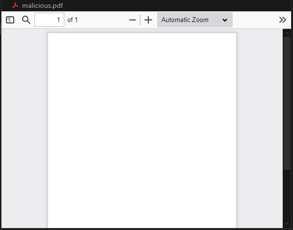
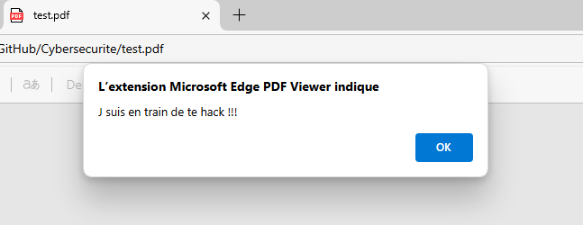
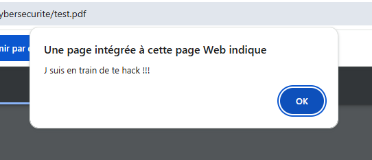
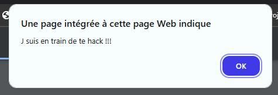
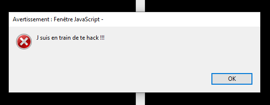

# Malicious PDF Research Project

## Description
Ce projet explore la manière dont les fichiers PDF peuvent être manipulés pour intégrer du JavaScript exécutable. Cette technique a été exploitée par le passé pour exécuter des actions malveillantes. L'objectif ici est purement éducatif et vise à mieux comprendre les vulnérabilités potentielles des lecteurs PDF et les mesures de protection existantes.

Le projet consiste à :
- Générer un fichier PDF en Python
- Injecter un code JavaScript dans le PDF
- Tester le fichier dans un environnement sécurisé
- Analyser le comportement des lecteurs PDF face à ce fichier

⚠️ **Ce projet est uniquement destiné à des fins de recherche et de sensibilisation.** Il doit être exécuté dans un environnement contrôlé et sécurisé (sandbox ou machine virtuelle) pour éviter tout risque de sécurité.
---

## Prérequis
### 1️ Installer Python
Téléchargez Python depuis [python.org](https://www.python.org/downloads/)

Vérifier l'installation de Python:
```bash
python --version
```

### 2️ Installer les dépendances
```bash
pip install PyPDF2
```

---

## Instructions d'exécution
### 1️ Injecter du JavaScript dans le PDF
Exécutez le script suivant pour ajouter un script JavaScript qui affiche une alerte à l'ouverture du fichier :
```bash
python ScriptPDF.py
```
Cela générera un fichier `test.pdf`.

### 2️ Tester le fichier PDF dans un environnement sécurisé
- **Utilisez une machine virtuelle (VM) ou un sandbox**.
- **Désactivez l'accès Internet de la VM** pour éviter tout risque.
- **Ouvrez `test.pdf` avec un lecteur PDF compatible avec JavaScript**.

### 3️ Analyser et documenter
- Tester sur plusieurs lecteurs PDF (Adobe Reader, Foxit Reader, etc.).
- Noter les protections et les réactions des logiciels.
- Identifier les versions vulnérables et les meilleures pratiques de sécurisation.


### 4️ Lecteur PDF tester:
- vscode-pdf v1.2.2


- Mircosoft Edge Version 133.0.3065.69:


- Google Chrome Version 133.0.6943.99:


- Brave Version 1.75.178 Chromium: 133.0.6943.98:


- Adobe Acrobat PRO DC Version 2022.001.20085:

